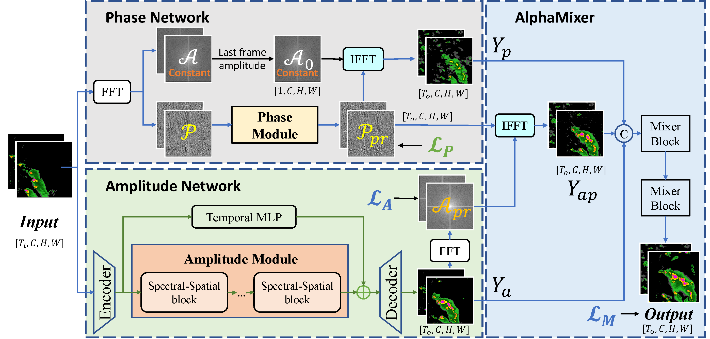

# AlphaPre-CVPR2025
Official implementation of "[AlphaPre: Amplitude-Phase Disentanglement Model for Precipitation Nowcasting](https://openaccess.thecvf.com/content/CVPR2025/html/Lin_AlphaPre_Amplitude-Phase_Disentanglement_Model_for_Precipitation_Nowcasting_CVPR_2025_paper.html)"



## Introduction

AlphaPre is an amplitude-phase disentanglement model for precipitation nowcasting that separately learns positional and intensity changes by leveraging phase and amplitude variations in the frequency domain.

This repository contains the part of training and inference code for using AlphaPre to make predictions (5 --> 20) on SEVIR datasets. 

## Code

### Environment

```shell
conda env create -f env.yaml
conda activate alphapre
```
<details close>
<summary>Optional Accelerate Env</summary>

 We apply the `HuggingFace Accelerator` in our code to utilize multi-gpus. 
 One can config the accelerator env before runing code.

-  config the accelerate: `accelerate config`      
- apply accelerate to run code: `accelerate launch *.py`
</details>

### Resource
pretrained checkpoint: [GoogleDrive](https://drive.google.com/file/d/1hzT2-biQhWuKTER8w1yoQx5Zh0nMYl80/view?usp=sharing)


### Datasets
All four datasets in our paper are from [DiffCast](https://github.com/DeminYu98/DiffCast).
You can find the datasets as follows:
- [SEVIR](https://nbviewer.org/github/MIT-AI-Accelerator/eie-sevir/blob/master/examples/SEVIR_Tutorial.ipynb)
- [Metnet](https://meteofrance.github.io/meteonet/english/data/rain-radar/)
- [Shanghai_Radar](https://dataverse.harvard.edu/dataset.xhtml?persistentId=doi:10.7910/DVN/2GKMQJ)
- [CIKM_Radar](https://tianchi.aliyun.com/dataset/1085)

### Evaluation
Before evaluation, you need to [download](https://drive.google.com/file/d/1hzT2-biQhWuKTER8w1yoQx5Zh0nMYl80/view?usp=sharing) the pretrained checkpoint and put it in `resources/`
```shell
# Note: Config the dataset path in `dataset/get_dataset.py` before running.
python run.py --eval --ckpt_milestone resources/AlphaPre_sevir128.pt  
```
### Training
```shell
python run.py
```
You can check the experimental configuration by
```shell
python run.py -h
```

## Acknowledgement

We refer to implementations of the following repositories and sincerely thank their contribution for the community:
- [OpenSTL](https://github.com/chengtan9907/OpenSTL/blob/OpenSTL-Lightning/README.md)
- [DiffCast](https://github.com/DeminYu98/DiffCast)

## Citation
```
@InProceedings{Lin2025AlphaPre,
    author    = {Lin, Kenghong and Zhang, Baoquan and Yu, Demin and Feng, Wenzhi and Chen, Shidong and Gao, Feifan and Li, Xutao and Ye, Yunming},
    title     = {AlphaPre: Amplitude-Phase Disentanglement Model for Precipitation Nowcasting},
    booktitle = {Proceedings of the Computer Vision and Pattern Recognition Conference (CVPR)},
    month     = {June},
    year      = {2025},
    pages     = {17841-17850}
}
```
